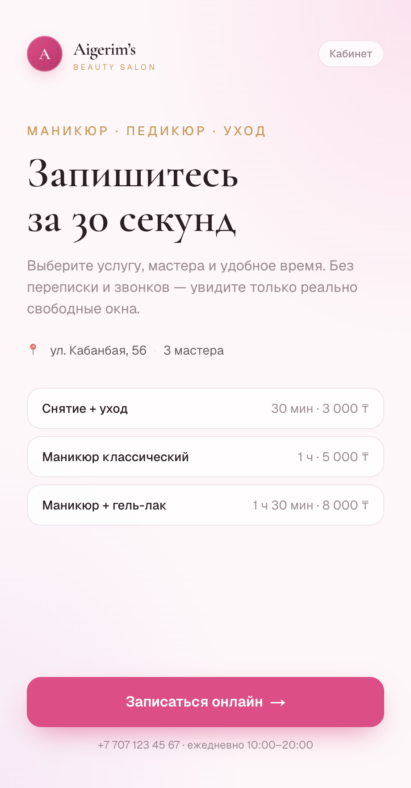
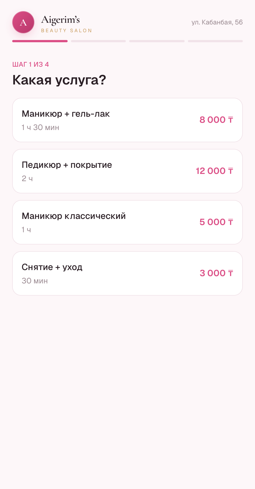
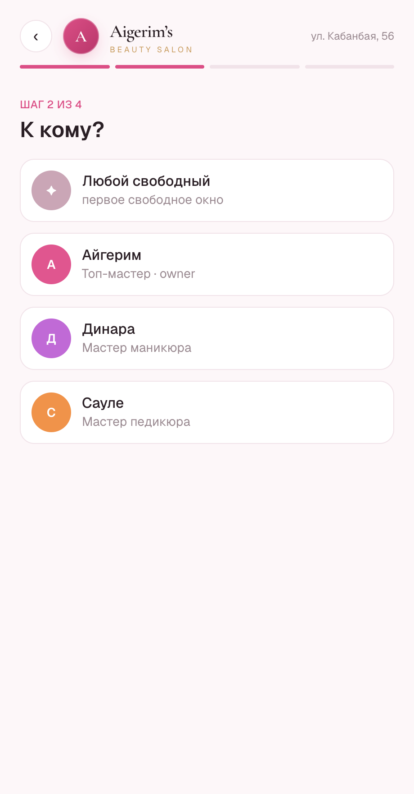
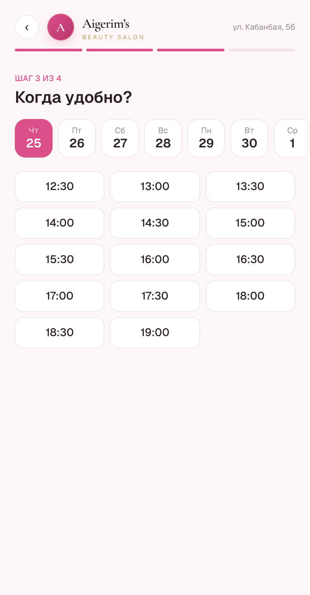
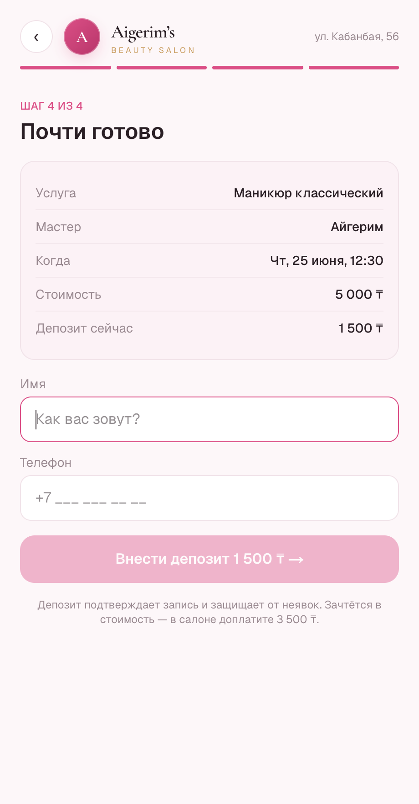
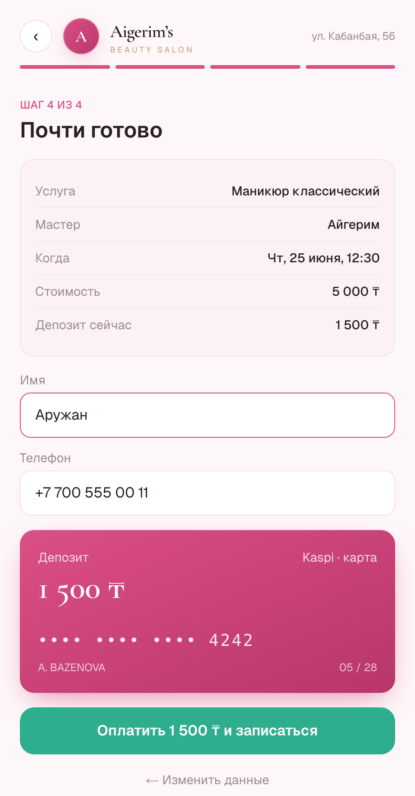
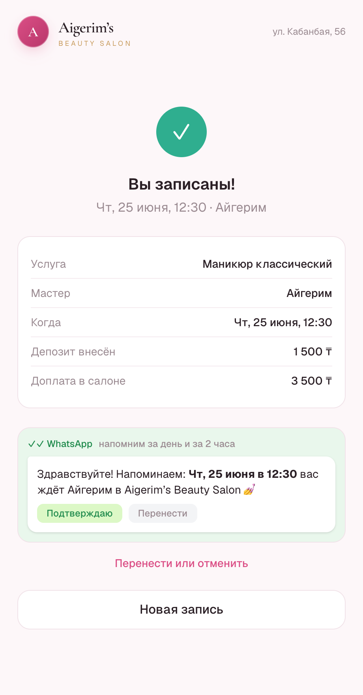
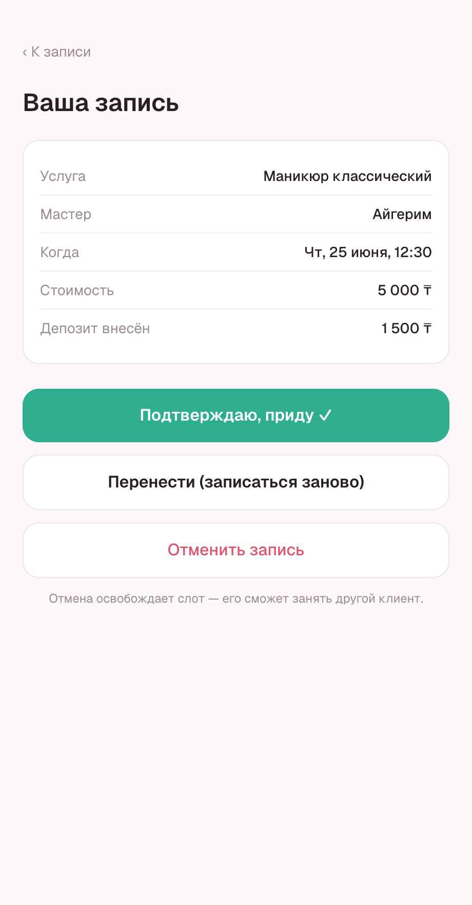
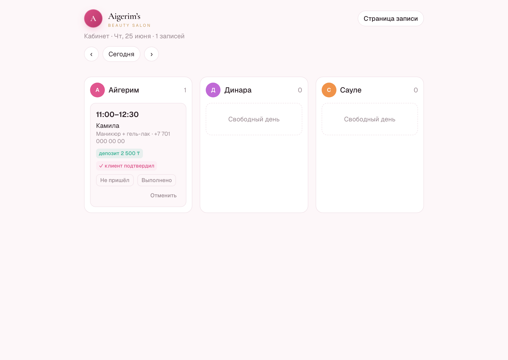

# Aigerim's Beauty Salon — онлайн-запись
### Тестовое задание Product Engineer · сдаточный документ

- 🔗 **Кликабельный прототип:** https://slot-jet.vercel.app
  - `/aigerim` — запись глазами клиента (ключевой флоу) · `/admin` — кабинет студии
- 💻 **Код (фронт + бэк):** https://github.com/bazenovaalima-sketch/slot_reserve

---

## 1. Проблема и пользователь

**Запрос Айгерим (как пришёл):** хаос с записью, двойные брони, мастера не в курсе, неявки, сгорающие слоты, гугл-календарь не зашёл, не хочет CRM «на сто кнопок».

**Настоящая боль (что под запросом):** Айгерим теряет **деньги** (пустые слоты от неявок и поздних отмен) и **нервы** (ручная синхронизация переписки → бумажного журнала → голов трёх мастеров). Корень один — **нет единого источника правды о расписании**. Запись живёт в WhatsApp, директе, журнале и в голове, поэтому накладки и потери неизбежны.

**Пользователи и роли:**
- **Владелица/админ (Айгерим)** — главный пользователь и плательщик. Хочет перестать вести запись вручную и видеть деньги/загрузку.
- **Мастер (×3)** — хочет в телефоне видеть «что у меня сегодня», без CRM-обвеса.
- **Клиентка** — хочет записаться за 30 секунд без переписки.

**JTBD:** «Когда клиентка хочет записаться — дай ей занять реально свободный слот за 30 секунд без переписки, так чтобы Айгерим не трогала журнал, мастер видел свой день, а освободившийся слот не сгорал».

**Приоритет болей (что берём первым и почему):**
1. **Накладки + ручной ввод** — берём первой. Это корень: убери переписку как канал записи и сделай единый календарь с защитой от пересечений — исчезает и двойная бронь, и «мастер не знал». Самый дешёвый и острый wedge.
2. **Неявки** — вторая. Депозит + напоминания.
3. **Сгорающие слоты от отмен** — третья. Лист ожидания + автозаполнение.

> Пока запись идёт через переписку, любые напоминания и листы ожидания бессмысленны — нет источника правды. Сначала переносим запись в систему, потом наслаиваем борьбу с потерями.

---

## 2. Скоуп и решение

**Идея:** одна **ссылка-запись** салона (в bio инстаграма / в ответ в WhatsApp). Клиентка выбирает услугу → мастера (или «любого») → видит только реально свободные слоты → вносит депозит → готово. Запись падает в **единый календарь**, который физически не даёт двойную бронь. Мастер открывает свою страницу и видит день. Депозит и напоминания режут неявки. Отмена в один тап освобождает слот.

**v1 — что строим:** публичная страница записи · единый календарь с анти-накладкой · услуги и рабочие часы мастеров · депозит против неявок · WhatsApp-напоминание + подтверждение клиентом · кабинет студии (день по мастерам) · отмена клиентом по ссылке.

**Что НЕ строим в v1 (смелость выкинуть):** полноценную CRM (карточки, история, теги, лояльность) · аналитику и отчёты · зарплаты мастеров и склад · мультифилиалы и роли с правами · нативные приложения · прямую интеграцию с WhatsApp/Instagram API (v1 — просто ссылка).

**Допущения:** одна студия, ≤5 мастеров, услуги фиксированной длительности · слоты шагом 30 мин · один часовой пояс (Asia/Almaty) · клиент идентифицируется телефоном, без регистрации · язык — русский.

**Компромиссы:** нет авторизации клиента → отмена/подтверждение по уникальной ссылке · оплата депозита и отправка напоминаний в прототипе **замоканы** (без реального Kaspi/WhatsApp-провайдера) — показана механика, в коде помечены точки интеграции.

---

## 3. Требования и user flow

**Функциональные:** публичная страница услуг/мастеров · расчёт свободных слотов (рабочие часы − записи, под длительность услуги) · создание записи с **атомарной** проверкой пересечения · депозит-гейт перед бронью · подтверждение записи + ссылка управления · кабинет с днём по мастерам · отмена → слот свободен · напоминание + статус подтверждения.

**Нефункциональные:** никогда не показывать слот, ведущий к накладке (источник правды — БД, проверка на сервере) · мобайл-фёрст, без регистрации · понятные состояния (занято/выбрано/ошибка) · идемпотентность создания.

**User flow по ролям:**
- **Клиентка:** ссылка → услуга → мастер/«любой» → дата+время (только свободное) → имя+телефон → депозит → успех + превью напоминания.
- **Мастер:** своя ссылка → день списком → детали клиента → «пришёл / не пришёл».
- **Админ:** все записи всех мастеров, ручная отмена, действие «Напомнить», статусы депозита/подтверждения.

**Краевые случаи (покрыты):**
- **Гонка за слот** — двое жмут «подтвердить» на один слот → выигрывает первый, второму честная ошибка «слот только что заняли».
- **Отмена** — слот освобождается (в v2 уходит первому из листа ожидания).
- **Неявка** — отметка no_show; при оплаченном депозите помечается «депозит удержан».
- **Выходной/отпуск мастера** — его слоты исчезают из выдачи (у Динары вс+пн выходные).
- **Запись в прошлое / впритык** — слоты раньше «сейчас» не показываются.
- **Услуга длиннее остатка смены** — не показываем слот, который не помещается до конца дня.

---

## 4. Нарезка на релизы и модули

**Модули:** A. Каталог · B. Расписание · C. Движок доступности · D. Бронирование (анти-накладка) · E. Витрина клиента · F. Кабинет мастера/админа · G. Уведомления · H. Анти-потери (депозит, лист ожидания, no-show) · I. Каналы (WhatsApp/Instagram, аналитика).

| Релиз | Что входит | Модули | Логика |
|------|-----------|--------|--------|
| **v1 / Now** | Самозапись по ссылке, календарь без накладок, депозит, напоминание+подтверждение, кабинет, отмена | A–H (частично) | Убирает корень боли: переписку и двойные брони. Минимум, который уже даёт ценность и режет неявки. |
| **v2 / Next** | Реальные WhatsApp/SMS-напоминания, **лист ожидания + автозаполнение** освободившихся слотов | G, H | Бьёт по «сгоревшим слотам» поверх готового календаря — прямой возврат денег. |
| **v3 / Later** | Интеграции с WhatsApp/Instagram, аналитика загрузки, постоянные клиенты, лояльность | I | Удержание и рост. Требует данных, накопленных в v1–v2. |

**Почему именно это в v1:** без единого источника правды (C+D) ничего из остального не работает; депозит и напоминания (H, G) дают самый быстрый возврат денег и дёшевы поверх готового календаря.

---

## 5. Прототип — флоу и почему

**Ключевой флоу: самозапись клиентки** (услуга → мастер → время → депозит → успех). Почему он:
- Это **wedge** — точка, где умирают сразу все боли (хаос переписки, двойные брони, «мастер не знал»).
- Это экран, которого касается клиент → на нём видно вкус и UX.
- Самодостаточен: кликабелен от начала до подтверждения.

Собран **фронт + бэк целиком** (не мокап): реальная БД, движок доступности и защита от двойной брони на сервере.

### Скриншоты

| Лендинг салона | Выбор услуги | Выбор мастера |
|---|---|---|
|  |  |  |

| Дата и время | Контакты | Депозит (мок-оплата) |
|---|---|---|
|  |  |  |

| Успех + WhatsApp-напоминание | Управление записью | Кабинет студии |
|---|---|---|
|  |  |  |

### Чем отличается от обычных «записей»
- **Депозит против неявок** — бронь подтверждается мини-предоплатой (~30%, зачитывается в стоимость). В кабинете при неявке видно «депозит удержан».
- **Умные напоминания** — на экране успеха клиент сразу видит превью WhatsApp-сообщения с кнопками «Подтверждаю / Перенести»; подтверждение загорается в кабинете.

---

## Стек и архитектура

Next.js 16 (App Router, Server Actions) · React 19 · Prisma 7 · PostgreSQL (Neon) · Tailwind v4 · деплой Vercel. Фронт и бэк в одном репозитории; доступность и анти-накладка считаются на сервере (источник правды — БД), проверка пересечения — внутри транзакции.

---

## Рефлексия

**На что ушло время:** ~60% — продуктовое мышление (найти настоящую боль, выбрать острый wedge, честно выкинуть лишнее) и ~40% — один доведённый флоу с реальным фронтом и бэком: движок доступности, защита от двойной брони в транзакции, депозит и напоминания.

**Что сделал бы за ещё 3 дня (по приоритету):** 1) **Лист ожидания + автозаполнение** освободившихся слотов — это прямой возврат денег и главная боль клиента, которую конкуренты не закрывают. 2) **Реальные** WhatsApp-напоминания и Kaspi-оплата депозита через провайдеров. 3) Кабинет: рабочие часы/выходные и услуги редактируются из UI, а не из сида.
